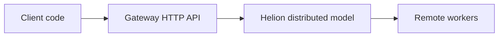

# Helion Decentralized Inference — Usage Guide

This guide shows how to run Helion in decentralized inference mode, both as a client (Python) and as an operator running the gateway/worker stack.

## Prerequisites
- Python 3.9+ with PyTorch and `helion` installed.
- Docker + Docker Compose (for gateway/worker).
- Hugging Face auth if the model is gated/private (`huggingface-cli login` or set `HF_TOKEN`/`HUGGINGFACE_HUB_TOKEN`).
- Open ports (default worker `31337`, gateway `8000`) reachable from your clients or swarm peers.

## Models (what you can load)
Helion supports a fixed set of Hugging Face *model types* (architectures). You can use **any checkpoint** of these types, as long as you pass the correct HF repo id (or a local path):

- **Llama** (`model_type="llama"`): e.g. `meta-llama/Llama-3.2-1B-Instruct`, `meta-llama/Meta-Llama-3.1-8B-Instruct`
- **Mixtral** (`model_type="mixtral"`): e.g. `mistralai/Mixtral-8x7B-Instruct-v0.1`
- **Falcon** (`model_type="falcon"`): e.g. `tiiuae/falcon-40b-instruct`
- **BLOOM** (`model_type="bloom"`): e.g. `bigscience/bloom`, `bigscience/bloomz`
- **Gemma 3 family** (`model_type="gemma3"`): e.g. `google/medgemma-4b-it`, `google/medgemma-27b-it`
- **GPT‑OSS** (`model_type="gpt_oss"`): e.g. `openai/gpt-oss-20b`
- **Qwen3 family** (`model_type="qwen3"`): e.g. `Qwen/Qwen3-0.6B` (and other Qwen3 sizes like 4B/30B — use the exact repo id you want)

If you pass a model id whose `model_type` is not in the supported list, Helion will fail with an error like “Petals does not support model type …”.

## Operational note: clearing worker cache after upgrades

If you upgrade Helion after hitting **KV-cache / shape errors** (especially on **Qwen3**), restart your workers and remove any persisted cache directory so you don’t reuse stale KV caches created by older code.

- Docker Compose workers: stop the worker containers and delete `compose/worker/helion-cache/`
- Then start the workers again so caches are rebuilt with the updated tensor layouts

## Quickstart: Python client
```python
from helion.utils.auto_config import AutoDistributedConfig
from helion.utils.auto_config import AutoDistributedModelForCausalLM
from transformers import AutoTokenizer

model_id = "meta-llama/Llama-3.2-1B-Instruct"
hf_token = None  # or "hf_xxx" for private/gated models

# Build config with distributed fields; override initial_peers for private swarms
config = AutoDistributedConfig.from_pretrained(
    model_id,
    token=hf_token,
    initial_peers=[
        # Replace with your swarm bootstrap nodes
        "/ip4/203.0.113.10/tcp/31337/p2p/PeerIdHere",
    ],
)

# Optional: GPT-OSS workaround if needed
config._keep_in_fp32_modules = ()

tokenizer = AutoTokenizer.from_pretrained(model_id, token=hf_token)
tokenizer.padding_side = "left"
if tokenizer.pad_token is None:
    tokenizer.pad_token = tokenizer.eos_token

model = AutoDistributedModelForCausalLM.from_pretrained(model_id, config=config, token=hf_token)

inputs = tokenizer("Hello from Helion", return_tensors="pt", padding=True)
out = model.generate(**inputs, max_new_tokens=64)
print(tokenizer.decode(out[0], skip_special_tokens=True))
```

Notes:
- Use `AutoDistributedConfig/Model*` from Helion, not plain HF `AutoConfig`, so you get distributed fields (initial_peers, dht_prefix, etc).
- Keep `padding_side="left"` for decoder-only models when batching.

## Using multiple models (e.g., Llama + GPT-OSS)
You can load multiple distributed models in one process; keep one tokenizer per model.
```python
from helion.utils.auto_config import AutoDistributedConfig, AutoDistributedModelForCausalLM
from transformers import AutoTokenizer

model_ids = [
    "meta-llama/Llama-3.2-1B-Instruct",
    "your-org/gpt-oss-model",
]
hf_token = None
initial_peers = ["/ip4/203.0.113.10/tcp/31337/p2p/PeerIdHere"]

MODELS = {}
TOKENIZERS = {}

for mid in model_ids:
    config = AutoDistributedConfig.from_pretrained(mid, token=hf_token, initial_peers=initial_peers)
    # GPT-OSS quirk: clear fp32 list
    if getattr(config, "model_type", "") == "gpt_oss":
        config._keep_in_fp32_modules = ()

    tok = AutoTokenizer.from_pretrained(mid, token=hf_token)
    tok.padding_side = "left"
    if tok.pad_token is None:
        tok.pad_token = tok.eos_token

    model = AutoDistributedModelForCausalLM.from_pretrained(mid, config=config, token=hf_token)
    MODELS[mid] = model
    TOKENIZERS[mid] = tok

# Use a specific model/tokenizer
mid = model_ids[0]
inputs = TOKENIZERS[mid]("Hello multi-model", return_tensors="pt", padding=True)
out = MODELS[mid].generate(**inputs, max_new_tokens=32)
print(TOKENIZERS[mid].decode(out[0], skip_special_tokens=True))
```
Tips:
- Keep configs/tokenizers/models keyed by model id; don’t mix tokenizers between models.
- For private swarms, ensure all models share the correct `initial_peers` and `dht_prefix` per swarm.

## Sample multi-model server (copy/paste)
If you want a simple HTTP server (FastAPI) that loads multiple Helion distributed models and lets you switch via a `model` field, you can reuse the pattern from `scripts/serve_multi_models.py` in your own repo.

```python
import os
from typing import Dict, List, Optional

import uvicorn
from fastapi import FastAPI, HTTPException
from pydantic import BaseModel
from transformers import AutoTokenizer

from helion.utils.auto_config import AutoDistributedConfig, AutoDistributedModelForCausalLM


class ChatRequest(BaseModel):
    model: Optional[str] = None
    messages: List[dict]
    max_tokens: int = 256
    temperature: float = 0.2
    top_p: float = 0.95


def load_models(model_ids: List[str], hf_token: Optional[str], initial_peers: Optional[List[str]]):
    tokenizers: Dict[str, AutoTokenizer] = {}
    models: Dict[str, AutoDistributedModelForCausalLM] = {}

    for mid in model_ids:
        # IMPORTANT: dht_prefix must match the workers for this model.
        # If you leave it unset, Helion may derive it from the repo name.
        cfg = AutoDistributedConfig.from_pretrained(
            mid,
            token=hf_token,
            initial_peers=initial_peers,
            dht_prefix=mid,  # per-model prefix (recommended for multi-model)
        )
        # GPT-OSS: bypass fp32 keep-list validation
        if getattr(cfg, "model_type", "") in {"gpt_oss", "gpt-oss"}:
            cfg._keep_in_fp32_modules = None
            cfg._keep_in_fp32_modules_strict = None

        tok = AutoTokenizer.from_pretrained(mid, token=hf_token)
        tok.padding_side = "left"
        if tok.pad_token is None:
            tok.pad_token = tok.eos_token

        mdl = AutoDistributedModelForCausalLM.from_pretrained(mid, config=cfg, token=hf_token)
        models[mid] = mdl
        tokenizers[mid] = tok

    return models, tokenizers


def create_app(models, tokenizers, default_model: str):
    app = FastAPI(title="Helion Multi-Model Server")

    @app.get("/health")
    def health():
        return {"status": "ok", "models": list(models.keys())}

    @app.post("/chat")
    def chat(req: ChatRequest):
        model_id = req.model or default_model
        if model_id not in models:
            raise HTTPException(status_code=400, detail=f"Model {model_id} not loaded")

        tok = tokenizers[model_id]
        mdl = models[model_id]

        if hasattr(tok, "apply_chat_template"):
            input_ids = tok.apply_chat_template(
                req.messages,
                add_generation_prompt=True,
                return_tensors="pt",
            ).to(mdl.device)
        else:
            prompt = "\n".join(f"{m.get('role')}: {m.get('content')}" for m in req.messages)
            input_ids = tok(prompt, return_tensors="pt").input_ids.to(mdl.device)

        outputs = mdl.generate(
            input_ids,
            max_new_tokens=req.max_tokens,
            do_sample=req.temperature > 0.0,
            temperature=max(0.0, req.temperature),
            top_p=req.top_p,
        )
        return {"model": model_id, "output": tok.decode(outputs[0], skip_special_tokens=True)}

    return app


if __name__ == "__main__":
    model_ids = [
        "meta-llama/Llama-3.2-1B-Instruct",
        "openai/gpt-oss-model",
    ]
    initial_peers = [
        "/ip4/34.143.175.170/tcp/31337/p2p/QmPXGhXJRDZZLRPDKSRXGnM9FiccEncxqrLjWSLZhjgKZS",
    ]
    hf_token = os.environ.get("HF_TOKEN") or os.environ.get("HUGGINGFACE_HUB_TOKEN")

    models, tokenizers = load_models(model_ids, hf_token, initial_peers)
    app = create_app(models, tokenizers, default_model=model_ids[0])
    uvicorn.run(app, host="0.0.0.0", port=8080)
```

## Private swarm / initial peers
- By default Helion connects to the public swarm. To use a private swarm, set `initial_peers` to your bootstrap nodes and ensure all peers share the same `dht_prefix`.
- Environment examples:
  - `INITIAL_PEERS="/ip4/203.0.113.10/tcp/31337/p2p/PeerIdA,/ip4/203.0.113.11/tcp/31337/p2p/PeerIdB"`
  - `DHT_PREFIX="my-private-model"`
- For programmatic use, pass `initial_peers` into `AutoDistributedConfig.from_pretrained(...)` as shown above.

## HF authentication
- If the repo is gated/private, pass `token="hf_xxx"` (or rely on `huggingface-cli login` / `HF_TOKEN` env var).
- Helion client will auto-set `use_auth_token=True` when `always_needs_auth` detects a gated model and no token was provided.

## Deploy gateway + worker via Compose

### Worker
`compose/worker/config.yml` controls the serving node.
- Key fields:
  - `converted_model_name_or_path`: model repo or converted path.
  - `initial_peers`: bootstrap peers (public or your private swarm).
  - `port` / `host_maddrs` / `announce_maddrs`: how the swarm reaches your node.
  - `token`: HF token for gated weights.
  - `identity_path`: libp2p identity file (persist across restarts).
- Run:
```bash
docker compose -f compose/worker/docker-compose.yml up -d
```

Model examples for `compose/worker/config.yml`:
- `converted_model_name_or_path: "Qwen/Qwen3-0.6B"`
- `converted_model_name_or_path: "meta-llama/Llama-3.2-1B-Instruct"`
- `converted_model_name_or_path: "openai/gpt-oss-20b"`
- `converted_model_name_or_path: "google/medgemma-4b-it"`

### Gateway
`compose/gateway/app.py` loads allowed models and exposes an OpenAI-compatible API (default port 8000).
- Environment:
  - `MODEL_ID` (default: `meta-llama/Llama-3.2-1B-Instruct`)
  - `ALLOWED_MODELS` (comma-separated list; defaults to MODEL_ID)
  - `INITIAL_PEERS` for private swarm bootstrap (optional; defaults to public swarm)
  - `HUGGINGFACE_HUB_TOKEN` for gated models (optional)
- Run:
```bash
docker compose -f compose/gateway/docker-compose.yml up -d
```

### Basic flow


## Troubleshooting
- `unexpected keyword argument 'initial_peers'`: pass peers via `AutoDistributedConfig`, not the model constructor.
- `post_attention_layernorm ... _keep_in_fp32_modules`: set `config._keep_in_fp32_modules = ()` before model init (GPT-OSS quirk).
- Connectivity: verify your worker port is reachable; for private swarms ensure all nodes share `initial_peers` and `dht_prefix`.


